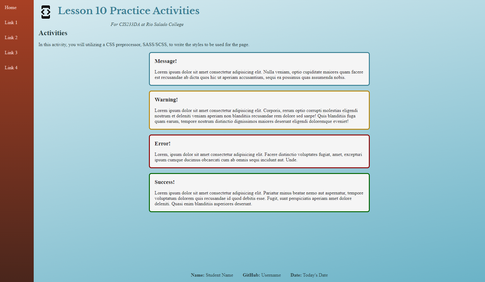

# CSS Preprocessor Activity
In this activity, you will create SCSS files and write styles using the SASS syntax. You will then compile the SCSS files into a CSS file that the browser can then utilize to style the webpage.

## Activity Objectives
1. Install a SASS Compiler Extension.
2. Write styles using the SCSS syntax.
3. Write SCSS variables to create a theme.
4. Import SCSS files.
5. Create extends styles to share common properties.
6. Compile the SCSS file into a CSS file.

## Install SASS Compiler Extension
Before you start, you will need to install an extension into your editor to help in converting the SCSS file into a standard CSS file that will be used in the page. With VS Code open:

1. Navigate to the Extensions pane (the icon looks like 3 squares in an 'L' shape and another square offset from the other squares).
2. Search for `Live Sass Compiler` by Glenn Marks.
3. Once you see it in the list, click on it to open the extension page.
4. Click on the install button to install it.

## HTML Directions
1. Open the `index.html` file.
2. Update the metadata within the `head` element with appropriate information.
3. Update the elements within the `footer` element with your information.
4. Save and apply a commit to the file.

## Styling the page with SCSS
You will now need to start writing the styles in the SCSS syntax, which is based upon CSS with some minor differences. Be sure to review the `Styling with SCSS` section within the lesson for basic tips that will help you write your styles for this activity.

### Turn on SASS Compiler
To get the SCSS file to compile into CSS, you need to enable the SASS compiler extension you installed previously.

1. Open the `style.scss` file.
2. In the status bar at the bottom of the VS Code window, you should see a `Watch Sass` button. 
   1. If you do not see the button, either you haven't installed the extension or there are no SCSS files in your project.
3. Click on the `Watch Sass` button. It should change to `Watching...`.
4. You can open the Output pane (under the View menu) to see when it converts the file from SCSS to CSS, if you wish to see it in action. 
5. When you save the file, the extension will run the conversion.
6. You can toggle this button on and off so you only compile to CSS when you want to.

### Create a page theme

1. Open the `theme.scss` file.
2. Under the `Import Font` comment:
   1. Import a serif font and a sans-serif font using [Google Fonts](https://fonts.google.com/).
3. Under the `Create theme variables` comment and using SCSS variables:
   1. Create a variable for `font-headings` and apply the serif font and fallback fonts.
   2. Create a variable for `font-body` and apply the serif font and fallback fonts.
   3. Create 4 main color variables, a light, medium light, medium dark, and dark color.
   4. Create 3 accent color variables, a light, a dark, and medium dark color.
4. Save and apply a commit to the file.

### Create the styles

1. If you don't have it open already, open the `style.scss` file.
2. Under the `Import other files` comment:
   1. Import the theme.scss file using the `@use` keyword.

Add the following under the `Default Styles` comment:

1. Using a universal selector, reset the margins to `0`, the paddings to `0`, and change the box sizing to border box.
2. Style the body element as follows:
   1. Add a height of `100vh`.
   2. Apply the `font-body` variable from the theme file you created earlier. *TIP: be sure you indicate that the variable is in the theme file with the file's name.*
   3. Apply the dark main color variable to the text color.
   4. Create a linear background gradient using the light and medium light colors.
   5. Convert the element to a grid container.
   6. Define three grid row templates to use `5rem`, `calc(100vh - 7rem)`, and `2rem`, respectively.
   7. Define two grid column templates to use `7rem` and `1fr`.
3. Add a bottom padding of `1rem` to all the headings.
4. Save and apply a commit to the file.

For the following, use the nested element syntax to create the styles for the header element and its children:
1. Style the `header` as follows:
   1. Assign it to the grid cell of the first row, second column.
   2. Add a padding of `1rem`.
2. Style the `svg` element as follows:
   1. Float the element to the left.
   2. Change the height and width to `48px`.
   3. Apply a right margin of `1rem`.
3. Style the `h1` element as follows:
   1. Apply the `font-headings` variable as the font family.
   2. Apply the medium dark color to the text color.
4. Style the `p` element as follows:
   1. Apply an italic font style.
   2. Apply a left margin of `15rem`.
5. Save and apply a commit to the file.

For the main element:
1. Assign it to the grid cell of the second row, second column.
2. Add a padding of `1rem` to all sides.

For the following, use the nested element syntax to create the styles for the footer element and its children:
1. Style the `footer` element as follows:
   1. Assign it to the grid cell of the third row, second column.
   2. Convert the element to a flex container.
   3. Set the flex direction to be in a row.
   4. Justify the content to be in the center.
2. Style the `p` element as follows:
   1. Add a left and right padding of `1rem` and no top and bottom padding.
3. Style the `span` element as follows:
   1. Apply a bold font weight.
4. Save and apply a commit to the file.

For the following, use the nested element syntax to create the styles for the nav element and its children:
1. Style the `nav` element as follows:
   1. Create a linear background gradient using the accent colors.
   2. Assign it to the grid cell of the first column, spanning all three rows.
2. Style the `ul` element as follows:
   1. Remove the bullet markers from the list.
   2. Convert the element to a flex container.
   3. Set the flex direction to be a column.
3. Style the `a` element as follows:
   1. Remove the underline text decoration.
   2. Add a padding of `1rem` to all sides.
   3. Change the display to be `block`.
   4. Utilize the light accent color for the text color.
   5. Apply a hover state and do the following:
      1. Apply the medium light main color to the background.
      2. Apply the dark main color to the text color.
4. Save and apply a commit to the file.
  
For the following, utilize the extend selector to style the message elements on the page.
1. Create an extended selector with the name `alerts-shared` and apply the following styles.
   1. Create a `3px` wide solid border using the medium dark main color.
   2. Add a padding of `1rem` to all sides.
   3. Apply a background color of `whitesmoke`.
   4. Use the dark main color as the text color.
   5. Apply a border radius to all corners of `.5rem`.
   6. Apply a minimum width of `15rem` and a maximum width of `50%`.
   7. Apply a top and bottom margin of `1rem` and have the left and right margins set to `auto`.
2. Style the `normal-message` element as follows:
   1. Use the `@extend` keyword to extend the `alerts-shared`.
3. Style the `error-message` element as follows:
   1. Use the `@extend` keyword to extend the `alerts-shared`.
   2. Change the border color to `darkred`.
4. Style the `success-message` element as follows:
   1. Use the `@extend` keyword to extend the `alerts-shared`.
   2. Change the border color to `darkgreen`.
5. Style the `warning-message` element as follows:
   1. Use the `@extend` keyword to extend the `alerts-shared`.
   2. Change the border color to `darkgoldenrod`.
6. Save and apply a commit to the file.

At this point, you should see the style.css file within the `css` subfolder. And the index.html file should appear like the image below, barring differences in your color choice.

## Conclusion
When you are done with the activity:
1. Be sure you check for any validation, spelling, and grammar errors and correct them.
2. Publish your website to GitHub pages.
3. Sync the files (i.e., push your changes) with the remote repo on GitHub.